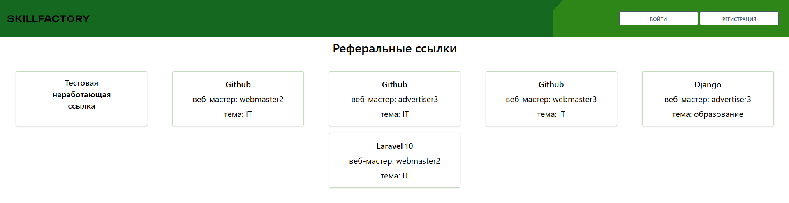

#  SF-AdTech - Система управления партнерским маркетингом

<div align="center">


*Мощная платформа для автоматизации партнерского маркетинга с реальным временем обновления данных*

</div>



##  О проекте

**SF-AdTech** — это комплексная система для управления партнерским маркетингом, разработанная на современном стеке технологий. Платформа соединяет рекламодателей, желающих привлекать трафик на свои сайты, и веб-мастеров, готовых размещать рекламные материалы.

###  Ключевые возможности

- **🤝 Многосторонняя платформа** - взаимодействие между рекламодателями, веб-мастерами и администраторами
- **⚡ Real-time обновления** - мгновенное отображение изменений через WebSocket соединения
- **📊 Продвинутая аналитика** - детальная статистика по кликам, конверсиям и доходам
- **🎯 Умная система редиректов** - отслеживание переходов с автоматическим подсчетом комиссий
- **👥 Гибкая система ролей** - разделение прав доступа для разных типов пользователей

##  Архитектура системы

### Технологический стек

| Компонент | Технология |
|-----------|------------|
| **Backend** | Laravel 8.x, PHP 8.2 |
| **Frontend** | Blade Templates, JavaScript, CSS3 |
| **База данных** | MySQL 8.0 |
| **Real-time** | WebSocket (Ratchet) |
| **Аутентификация** | Laravel Auth System |

### Модульная структура

```bash
SF-AdTech/
├── 📁 app/                          # Основная логика приложения
│   ├── 📁 Http/
│   │   └── 📁 Controllers/          # Обработка HTTP запросов
│   ├── 📁 Models/                   # Eloquent ORM модели
│   ├── 📁 Services/                 # Бизнес-логика и сервисы
│   └── 📁 Middleware/               # Промежуточное ПО
│
├── 📁 database/                     # Работа с базой данных
│   ├── 📁 migrations/               # Миграции структуры БД
│   └── 📁 seeders/                  # Наполнение тестовыми данными
│
├── 📁 public/                       # Публичные ресурсы
│   └── 📁 js/
│       └── 📁 websockets/           # WebSocket клиентская часть
│
├── 📁 resources/                    # Ресурсы приложения
│   └── 📁 views/
│       └── 📁 pages/                # Blade шаблоны страниц
│
└── 📁 storage/                      # Системное хранилище
    └── 📁 logs/                     # Файлы логов приложения
```

##  Роли пользователей

###  Администратор
- Управление пользователями и их правами
- Контроль системных настроек и комиссий
- Модерация тем офферов
- Просмотр общей статистики платформы

###  Рекламодатель
- Создание и управление рекламными офферами
- Установка стоимости за переход
- Просмотр детальной статистики кампаний
- Управление статусами офферов (активно/неактивно)

###  Веб-мастер
- Просмотр доступных офферов для продвижения
- Генерация уникальных реферальных ссылок
- Отслеживание доходов и конверсий
- Управление подписками на офферы

##  Быстрый старт

### Предварительные требования

- PHP 8.2 или выше
- Composer 2.x
- MySQL 8.0+
- Node.js 16+ (опционально)

## ⚙️ Установка и настройка

### Клонирование репозитория
```bash
git clone https://github.com/rwolfin/SF-AdTech.git
cd SF-AdTech
```


### Установка PHP зависимостей
```bash
composer install
```
### Установка фронтенд зависимостей
```bash
npm install
```

### Настройка окружения
```bash
cp .env.example .env
php artisan key:generate
```

### Конфигурация базы данных
```SQL
CREATE DATABASE `adtech_platform`;
```


### Обновите ```.env``` файл:
```env
DB_CONNECTION=mysql
DB_HOST=127.0.0.1
DB_PORT=3306
DB_DATABASE=adtech_platform
DB_USERNAME=root
DB_PASSWORD=

TIMEZONE=3
```

### Запуск миграций и сидов
```bash
php artisan migrate --seed
```


### Запуск сервера
```bash
php artisan serve
```

##  Запуск WebSocket сервера

Для работы real-time функций запустите WebSocket сервер:

# В отдельном терминале
```bash
php artisan websocket:serve
```

##  Тестовые аккаунты

| Роль | Email | Пароль |
|------|-------|--------|
| Администратор | admin@admin.ru | 123456789 |
| Рекламодатель 1 | advertiser1@skillfactory.ru | 123456789 |
| Рекламодатель 2 | advertiser2@skillfactory.ru | 123456789 |
| Рекламодатель 3 | advertiser3@skillfactory.ru | 123456789 |
| Веб-мастер 1 | webmaster1@skillfactory.ru | 123456789 |
| Веб-мастер 2 | webmaster2@skillfactory.ru | 123456789 |
| Веб-мастер 3 | webmaster3@skillfactory.ru | 123456789 |


##  Основные функции

### Для рекламодателей
✅ Создание офферов с настраиваемой стоимостью перехода  
✅ Управление статусами офферов в реальном времени  
✅ Детальная аналитика по кликам и конверсиям  
✅ Автоматический расчет расходов на рекламу  

### Для веб-мастеров
✅ Просмотр активных офферов с фильтрацией по темам  
✅ Генерация уникальных реферальных ссылок  
✅ Отслеживание доходов в личном кабинете  
✅ Real-time уведомления о новых офферах  

### Для администраторов
✅ Полный контроль над пользователями и их правами  
✅ Управление системными настройками и комиссиями  
✅ Модерация контента и тем офферов  
✅ Мониторинг общей статистики платформы  

##  API и интеграции

Система предоставляет RESTful API для интеграции с внешними сервисами:

- `GET /api/offers` - список активных офферов
- `POST /api/clicks` - регистрация переходов  
- `GET /api/statistics` - получение статистики

##  Отладка и логи

Система ведет детальное логирование:

- `storage/logs/laravel.log` - основные ошибки приложения
- `storage/logs/websocket.log` - логи WebSocket соединений
- `storage/logs/offer_clicks.log` - статистика переходов

##  Производительность

- Оптимизированные SQL запросы с индексацией
- Кэширование часто запрашиваемых данных
- Асинхронная обработка WebSocket сообщений
- Эффективная система миграций базы данных

##  Разработка и вклад

Для внесения изменений в проект:

1. Форкните репозиторий
2. Создайте feature ветку (`git checkout -b feature/amazing-feature`)
3. Закоммитьте изменения (`git commit -m 'Add amazing feature'`)
4. Запушьте ветку (`git push origin feature/amazing-feature`)
5. Откройте Pull Request


##  Автор

Разработано от rwolfin для образовательных целей в школе Skillfactory